# Geoffit Database Architecture — ER Diagram

Logical ERD after refinement. `AUTH_USERS` is external (Supabase Auth).

```mermaid
erDiagram
  AUTH_USERS ||--|| PROFILES : "id"
  PROFILES ||--|| USER_PREFERENCES : "presentation"
  PROFILES ||--o{ CONNECTED_SOURCES : connects
  PROFILES ||--o{ DEVICES : owns
  PROFILES ||--o{ INGEST_RUNS : runs
  PROFILES ||--o{ TIMELINE_ENTRIES : journey
  PROFILES ||--o{ BODY_WEIGHT : fact
  PROFILES ||--o{ BODY_COMPOSITION : fact
  PROFILES ||--o{ SLEEP_SESSIONS : fact
  PROFILES ||--o{ WORKOUTS : fact
  PROFILES ||--o{ NUTRITION_DAYS : fact
  PROFILES ||--o{ BLOOD_PANELS : fact
  PROFILES ||--o{ MEDICATIONS : fact
  PROFILES ||--o{ TREATMENTS : fact
  PROFILES ||--o{ SUPPLIES : fact
  PROFILES ||--o{ HEALTH_EVENTS : fact
  PROFILES ||--o{ PROGRESS_PHOTOS : fact
  PROFILES ||--o{ GOALS : fact
  PROFILES ||--o{ JOURNAL_ENTRIES : fact
  PROFILES ||--o{ AI_THREADS : ai
  PROFILES ||--o{ REPORTS : derived
  PROFILES ||--o{ NOTIFICATION_PREFERENCES : prefs

  CONNECTED_SOURCES ||--o{ INGEST_RUNS : produces
  CONNECTED_SOURCES ||--o| SYNC_STATE : tracks
  CONNECTED_SOURCES ||--o{ SYNC_FAILURES : logs
  INGEST_RUNS ||--o{ RAW_PAYLOADS : stores
  CONNECTED_SOURCES ||--o{ DEVICES : includes

  SLEEP_SESSIONS ||--o{ SLEEP_STAGES : contains
  WORKOUTS ||--o{ WORKOUT_EXERCISES : contains
  WORKOUT_EXERCISES ||--o{ WORKOUT_SETS : contains
  PROGRAMMES ||--o{ PROGRAMME_WEEKS : contains
  PROGRAMME_WEEKS ||--o{ PROGRAMME_SESSIONS : contains
  PROGRAMME_SESSIONS ||--o{ PROGRAMME_EXERCISES : contains
  PROGRAMME_SESSIONS ||--o{ SESSION_COMPLETIONS : done
  WORKOUTS ||--o{ SESSION_COMPLETIONS : fulfills

  NUTRITION_DAYS ||--o{ NUTRITION_MEALS : contains
  BIOMARKER_DEFINITIONS ||--o{ BLOOD_RESULTS : maps
  BLOOD_PANELS ||--o{ BLOOD_RESULTS : contains

  MEDICATIONS ||--o{ MEDICATION_SCHEDULES : scheduled
  MEDICATIONS ||--o{ MEDICATION_DOSE_EVENTS : dosed
  MEDICATIONS ||--o{ PRESCRIPTIONS : prescribed
  PRESCRIPTIONS ||--o{ PRESCRIPTION_REFILLS : refilled
  TREATMENTS ||--o{ TREATMENT_EVENTS : lifecycle
  TREATMENTS ||--o{ TREATMENT_MILESTONES : checkpoints
  TREATMENTS ||--o{ MEDICATION_TREATMENT_LINKS : uses
  MEDICATIONS ||--o{ MEDICATION_TREATMENT_LINKS : used_in
  TREATMENTS }o--o| PROGRAMMES : may_use

  SUPPLIES ||--o{ SUPPLY_BATCHES : batched
  STORAGE_LOCATIONS ||--o{ SUPPLY_BATCHES : stores
  SUPPLY_BATCHES ||--o{ INVENTORY_TRANSACTIONS : ledger
  SUPPLIES ||--o{ SUPPLIER_HISTORY : purchased
  MEDICATIONS }o--o| SUPPLIES : catalog_link

  PROGRESS_PHOTOS ||--o{ PHOTO_AI_COMPARISONS : compared
  USER_FILES ||--o| PROGRESS_PHOTOS : blob
  USER_FILES ||--o| RAW_PAYLOADS : blob
  USER_FILES ||--o| BLOOD_PANELS : pdf

  AI_THREADS ||--o{ AI_MESSAGES : contains
  AI_THREADS ||--o{ AI_FEEDBACK : rates
  AI_MEMORY ||--o{ AI_EMBEDDINGS : embedded
  AI_MESSAGES ||--o{ AI_EMBEDDINGS : embedded
  AI_TASKS ||--o{ AI_SUMMARIES : may_produce
  AI_TASKS ||--o{ AI_RECOMMENDATIONS : may_produce

  NOTIFICATION_RULES ||--o{ NOTIFICATION_QUEUE : enqueues
  NOTIFICATION_TEMPLATES ||--o{ NOTIFICATION_QUEUE : renders
  NOTIFICATION_QUEUE ||--o{ NOTIFICATION_HISTORY : delivered

  REPORT_SCHEDULES ||--o{ REPORTS : spawns
  REPORTS ||--o{ REPORT_EXPORTS : exports
  REPORT_EXPORTS }o--o| USER_FILES : file

  TIMELINE_ENTRIES }o--|| PROFILES : "indexed for"
  HEALTH_EVENTS ||--o| TIMELINE_ENTRIES : projected
  WORKOUTS ||--o| TIMELINE_ENTRIES : projected
  MEDICATION_DOSE_EVENTS ||--o| TIMELINE_ENTRIES : projected
  BLOOD_PANELS ||--o| TIMELINE_ENTRIES : projected
  REPORTS ||--o| TIMELINE_ENTRIES : projected_derived
  AI_SUMMARIES ||--o| TIMELINE_ENTRIES : projected_derived

  FEATURE_FLAGS ||--o{ USER_FEATURE_ACCESS : overrides
  EXPERIMENTS ||--o{ USER_FEATURE_ACCESS : assigns
```

## Cardinality notes

1. **Medications ↔ Treatments** are many-to-many via `medication_treatment_links`.  
2. **Supplies** may link to a medication catalog row but also stand alone (protein, kits).  
3. **Timeline** entries point at entities; they do not own clinical data.  
4. **AI / Reports** are derived subgraphs with read-only access to facts.  
5. **Ingestion** fans into all fact tables through application writers, not DB FKs from every fact to `ingest_runs` (optional `ingest_run_id` on facts for lineage).  
6. **`user_preferences`** is 1:1 with `profiles` (typed presentation row). Notifications / privacy / source prefs are separate tables.
